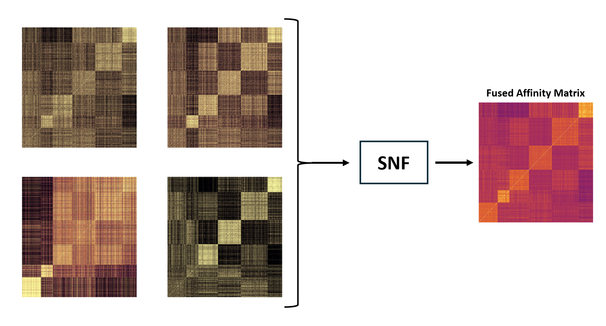

# Similarity Network Fusion (SNF) Framework



## Overview
This project is an enhanced implementation of the Similarity Network Fusion (SNF) method, a powerful tool for integrating multi-omics and other high-dimensional data. SNF allows the combination of different data types to uncover hidden structures, improving downstream clustering and classification tasks. This codebase is built for use in data science, bioinformatics, and other machine learning applications where data from multiple sources need to be analyzed.

## Origin and Improvements
This codebase was originally cloned from [snfpy](https://github.com/rmarkello/snfpy). The original repository provided foundational code for SNF but had not been maintained or updated for several years. We have made significant improvements to ensure compatibility with current Python libraries, added documentation, and optimized the SNF pipeline for better performance and usability.

## Installation
To use this SNF implementation, clone this repository and install the necessary dependencies:

```bash
git clone https://github.com/charite-icm/snf.git
cd snf
pip install -r requirements.txt
```

## Usage
Here’s an example of how to use the `Snf` class with toy data which can be found in `example_toydata.py`:

```python
import os
import pandas as pd
from sklearn.metrics import v_measure_score

from src.snf import Snf, DistanceMetric
from src.snf_package import datasets

def main() -> None:
    mod_names = ("0", "1", "2", "3")
    save_path = "results/test_toydata"

    digits = datasets.load_digits()
    
    # It is important that data frames contain a column named "eid" 
    dfs = [pd.DataFrame(arr, columns=[f"feature_{i}" for i in range(arr.shape[1])]) for arr in digits.data]
    for df in dfs:
        df["eid"] = df.index
    dfs = tuple(dfs)

    snf = Snf(dfs=dfs, mod_names=mod_names, save_path=save_path,
              plot_missing_percentage=True, th_nan=0.0, random_state=41,
              n_clusters=None, verbose=True)
    snf.set_affinity_matrix_param(K=0.1, mu=0.5, metric=DistanceMetric.EUCLIDEAN, normalize=False)
    snf.set_iterative_algorithm_param(t=20, alpha=1.0, top_k=20, edge_th=1.1)
    snf.main()

    labels = pd.read_csv(os.path.join(save_path, "fused/cluster_eids.csv"))["cluster"]
    print(v_measure_score(labels, digits.labels))

if __name__ == "__main__":
    main()
```

## Methodology
The SNF method combines data from multiple sources by constructing affinity matrices and iteratively updating them until convergence.

For more detailed information on the SNF method, please refer to:
- **Original SNF Paper**: [Wang et al., Nature Methods, 2014](https://www.nature.com/articles/nmeth.2810)
- **Our Paper**: [Your Paper Title, Journal Name, Year] (Include full reference)

## References
- Wang, B., Mezlini, A. M., Demir, F., Fiume, M., Tu, Z., Brudno, M., Haibe-Kains, B., & Goldenberg, A. (2014). Similarity network fusion for aggregating data types on a genomic scale. *Nature Methods*, 11(3), 333–337. [DOI](https://doi.org/10.1038/nmeth.2810)
- Your Paper: [Author(s), Year, Journal/Conference]

## Acknowledgements
This project builds on the work of [Markello et al., snfpy](https://github.com/rmarkello/snfpy) which is outdated and extends their original implementation.
